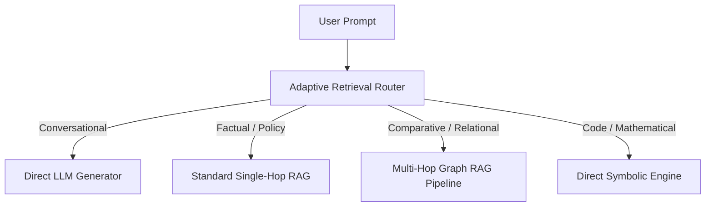

# genpark-adaptive-retrieval-router-skill

Agent Skill implementing **Adaptive Retrieval Routing** across direct reasoning, single-hop RAG, and multi-hop synthesis in 100% Python standard library.

## Architectural Flow

